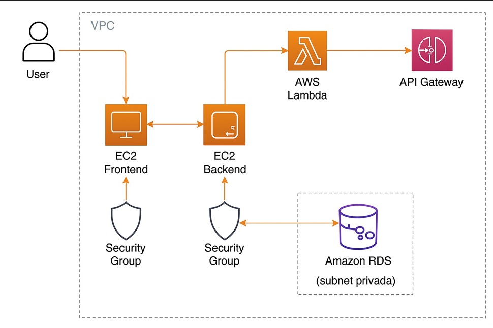

# Projeto Integrador – Cloud Developing 2025/1

> CRUD simples + API Gateway + Lambda `/report` + RDS

**Grupo**:

1. 10416945 - Vinícius Ambrosano Melo – Criação do Código + EC2 + Docker  
1.  - Lucas Lucinio – Integração com o Amazon RDS (PostgreSQL)  
1. 10418871 - Victor Oliveira Santos – Criação e Configuração do API Gateway  
1. 10418106 - Igor Shirata Duarte – Criação da Lambda e Integração com API Gateway  

---

## 1. Visão geral

Este projeto consiste em uma aplicação CRUD para gerenciamento de jogos. Ela permite cadastrar, listar e consultar dados de jogos, com um front-end simples em HTML/CSS e back-end em Flask (Python), totalmente containerizados em Docker e executados em instâncias EC2.

Utilizamos também:
- **Amazon RDS** para persistência dos dados (PostgreSQL)
- **API Gateway** para expor uma rota `/report`
- **AWS Lambda** para processar e retornar estatísticas da API

A escolha do tema foi baseada na familiaridade do grupo com aplicações web simples e na facilidade de visualização e testes ao vivo.

---

## 2. Arquitetura

| Camada   | Serviço                    | Descrição                                               |
|----------|----------------------------|---------------------------------------------------------|
| Frontend | EC2 + Docker               | Interface em HTML/CSS, acessada via IP público da EC2   |
| Backend  | EC2 + Docker               | API Flask que fornece as rotas do CRUD (`/games`)       |
| Banco    | Amazon RDS (PostgreSQL)    | Armazena os dados dos jogos em subnet privada           |
| Gateway  | Amazon API Gateway         | Rota `/report` redireciona requisições à Lambda         |
| Função   | AWS Lambda                 | Função serverless que consome a API e retorna JSON      |

---

## 3. Como rodar localmente
# Frontend
eval $(ssh-agent)
ssh-add chavepem.pem
ssh -A ec2-user@DNSPublicaEC2Frontend

# Backend
eval $(ssh-agent)
ssh-add chavepem.pem
ssh -A ec2-user@DNSPublicaEC2Frontend
ssh ec2-user@DNSPublicaEC2Backend

# Atualização dos pacotes
sudo apt update && sudo apt upgrade -y

# Instalação do Docker
sudo apt install docker.io -y
sudo usermod -aG docker $USER  # libera uso do docker sem sudo

# Clonagem do projeto
git clone https://github.com/seuusuario/seuprojeto.git
cd seuprojeto

# Build da imagem do front-end e back-end
docker build -t frontend-image frontend/
docker build -t backend-image backend/

# Execução dos contêineres com mapeamento de portas
docker run -d -p 8080:80 frontend-image        # HTML/CSS
docker run -d -p 5000:5000 backend-image      # Flask API

# Verificação e logs
docker ps                     # ver contêineres ativos
docker logs <container_id>   # ver saída dos contêineres

# Instalar cliente PostgreSQL e testar conexão
sudo apt install postgresql-client -y
psql -h <endpoint-rds> -U <usuario> -d postgres -p 5432
